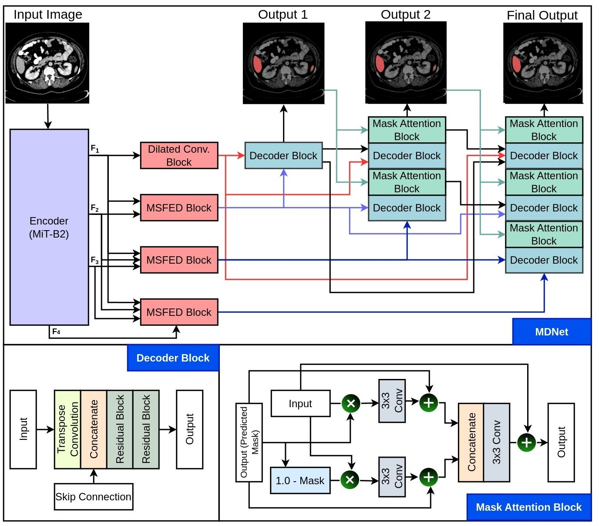
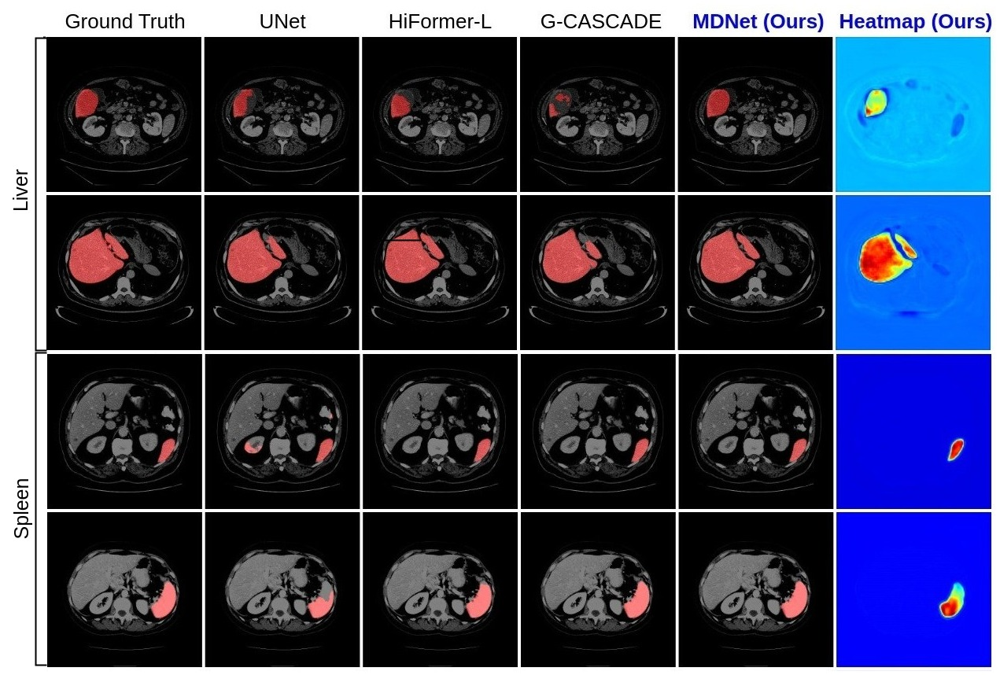

# MDNet: Multi-Decoder Network for Abdominal CT Organs Segmentation 

## 1. Abstract

Accurate segmentation of organs from abdominal CT scans is essential for clinical applications such as diagnosis, treatment planning, and patient monitoring. To handle challenges of heterogeneity in organ shapes, sizes, and complex anatomical relationships, we propose a \textbf{\textit{\ac{MDNet}}}, an encoder-decoder network that uses the pre-trained \textit{MiT-B2} as the encoder and multiple different decoder networks. Each decoder network is connected to a different part of the encoder via a multi-scale feature enhancement dilated block. With each decoder, we increase the depth of the network iteratively and refine segmentation masks, enriching feature maps by integrating previous decoders' feature maps. To refine the feature map further, we also utilize the predicted masks from the previous decoder to the current decoder to provide spatial attention across foreground and background regions. MDNet effectively refines the segmentation mask with a high dice similarity coefficient (DSC) of 0.9013 and 0.9169 on the Liver Tumor segmentation (LiTS) and MSD Spleen datasets

## 2. Architecture

### 2.1 Block diagram
|  |
| :--: |
| *The block diagram shows an overview of the proposed MDNet.* |

A MiT-B2 encoder processes the input image to extract feature maps at four different levels (F1, F2, F3, and F4). Each encoder network is connected to a different part of the decoder via a multi-scale feature enhancement dilated block to increase the depth of the network to predict three distinct segmentation masks. Additionally, the decoders are connected in a way that the output feature from the preceding decoders is utilized in the subsequent one to refine the segmentation output further. Moreover, we also use the predicted masks of the prior decoder in the subsequent decoder for the further refinement of the feature map. This process provides spatial attention across foreground and background regions and enhances the final segmentation results.

### 2.2 Implementation
The proposed architecture uses the PyTorch framework (1.9.0+cu111) with a single GeForce RTX 3090 GPU of 24 GB memory.

## 4. Results
| :--: |
| *Comparative evaluation of different models on the LiTS dataset and MSD dataset * |

| *Comparative evaluation of different models on the MSD spleen dataset* |

## 5. Citation
<pre>
@inproceedings{jha2025mdnet,
  title={MDNet: Multi-Decoder Network for Abdominal CT Organs Segmentation},
  author={Jha, Debesh and Tomar, Nikhil Kumar and Biswas, Koushik and Durak, Gorkem and Antalek, Matthew and Zhang, Zheyuan and Wang, Bin and Rahman, Md Mostafijur and Pan, Hongyi and Medetalibeyoglu, Alpay and others},
  booktitle={ICASSP 2025-2025 IEEE International Conference on Acoustics, Speech and Signal Processing (ICASSP)},
  pages={1--5},
  year={2025}
}
</pre>

## 4. License
The source code is free for research and education use only. Any commercial use should receive formal permission from the first author.

## 6. Contact
Please contact debesh.jha@usd.edu for any further questions.

