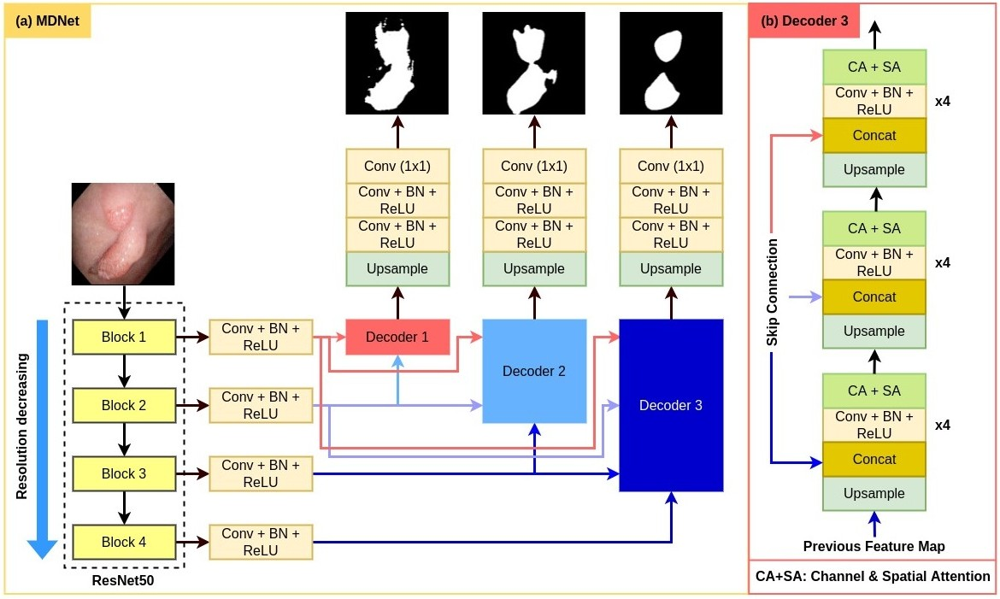
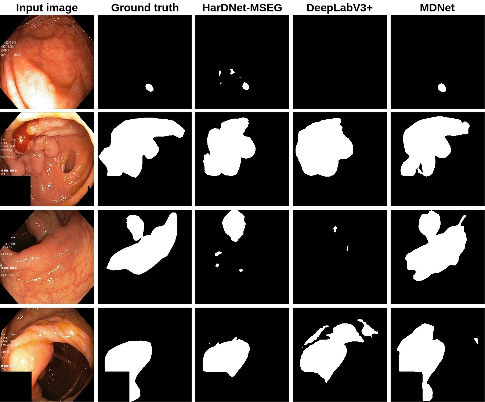

# MDNet: Multi Decoder Network for Polyp Segmentation in Colonoscopy

## Overview
MDNet is a cutting-edge deep-learning architecture designed for efficient and accurate polyp segmentation in colonoscopy images. It utilizes a novel encoder-decoder structure, leveraging the power of a pre-trained ResNet50 as its backbone. The architecture is tailored to process high-resolution medical images in real-time, ensuring both speed and precision in identifying polyps.

## Key Features:

- **Multi-Decoder Learning:** MDNet features multiple decoders, each linked to different stages of the encoder, enhancing the detail and accuracy of the segmentation.
- **High Performance:** The architecture achieves approximately 85% dice coefficient, indicating a high level of precision in polyp detection.
- **Real-Time Processing:** Capable of processing at 64 frames per second, MDNet is optimized for real-time applications in medical diagnostics.
- **Robust Testing:** The architecture has been thoroughly tested on four publicly available polyp datasets, showing its robustness and superiority over baseline models.
- **Interpretability through Visualization:** MDNet provides visual insights into its decision-making process, aiding medical professionals in understanding and trusting its outputs.
- **State-of-the-Art Results:** The system demonstrates exceptional performance, setting new benchmarks in the field of medical image analysis.

## MDNet Architecture 

## Architecture Advantages:
- Improved accuracy for medical image segmentation.
- Efficient learning of hierarchical features.
- Ability to capture long-range spatial dependencies.

  
## Uses of MDNet:
- Medical Image Segmentation 
- General Image Segmentation
- Anomaly Detection in Medical Images 
- Comparative Studies

## Dataset 
Kvasir dataset(https://datasets.simula.no/kvasir-seg/)

## Results
 **Qualitative results comparison of the SOTA methods**  

## Citation
Please cite our paper if you find the work useful: 
<pre>
@INPROCEEDINGS{8959021,
  author={D. {Jha},  K. {Biswas}, N. {Tomar}, U. {Bagci}},
  title={MDNet: Multi Decoder Network for Polyp Segmentation in Colonoscopy}, 
  year={2023}
</pre>

## Contact
Please contact debesh.jha@northwestern.edu for any further questions.
